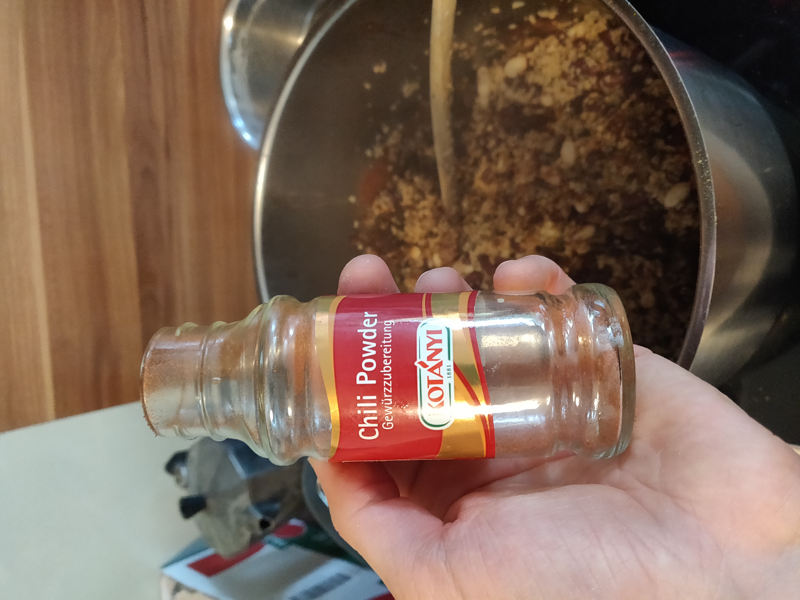

# Chili Sin Carne

## Nutritional info
- Servings: 4
- KCal: 462
- Carbs: 60.8g
- Fat: 1.7g
- Protein: 48.1g

## Ingredients
- Raw white beans 100g
- Raw kidney beans 200g
- Soy hash 250g

## Instructions
Soak beans over night/8 hours before, boil them for an hour.
Follow the images below, boil for 1-1.5 hours on low half-open.

