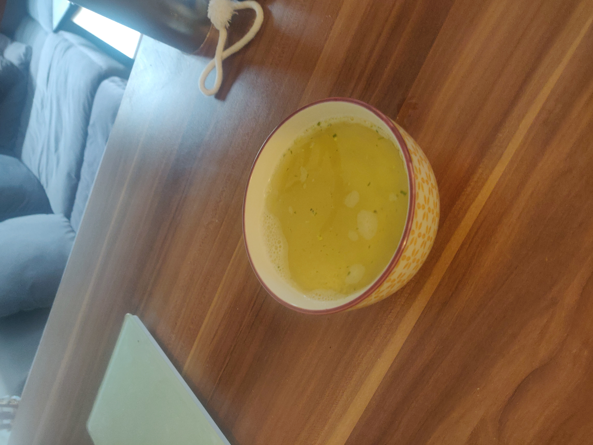
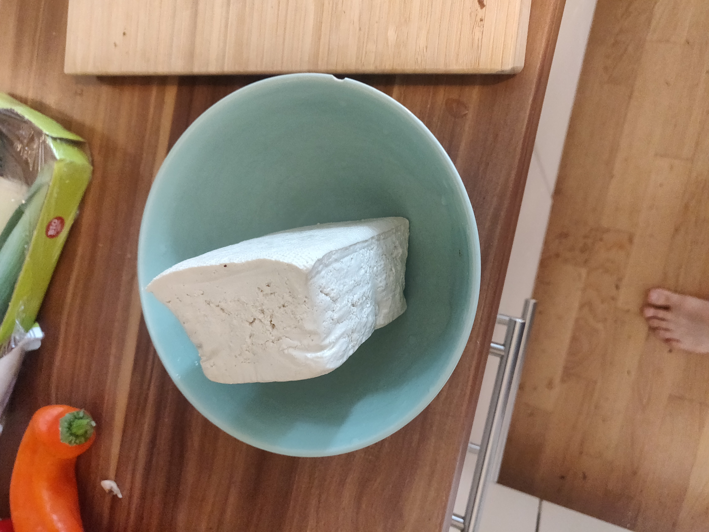

# Couscous Bean Tofu Scramble

## Nutritional info
- Servings: 3
- KCal: 517
- Carbs: 70g
- Fat: 10.5g
- Protein: 35.8g

## Ingredients
- Raw couscous 120g
- Tofu - 350g
- Raw kidney beans 200g

## Instructions
Soak beans over night/8 hours before, boil them for an hour.
Follow the images below.
I used leek and mushrooms and added broccoli as veggies.

