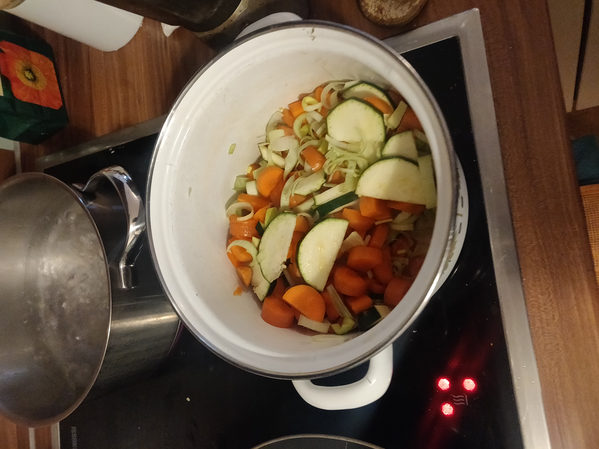

# Lentil Veggie Soup with Tofu Croutons

## Nutritional info
- Servings: 3
- KCal: 440
- Carbs: 26.3g
- Fat: 18.3g
- Protein: 42g

## Ingredients
- Tofu 700g
- Raw red lentils 120g
- Whatever veggies are laying around

## Instructions
Dice the Tofu very small and throw it into the oven for \~40-60 minutes at 200 C.
Add some oil to a pot, cut the veggies, fry them a bit, add water and lentils.
Let it boil for a bit and blend it down - add water depending on how thick you want it.

